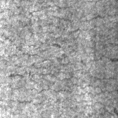
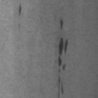
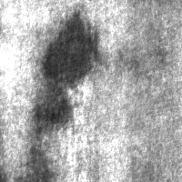
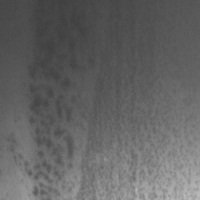
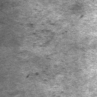
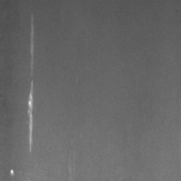
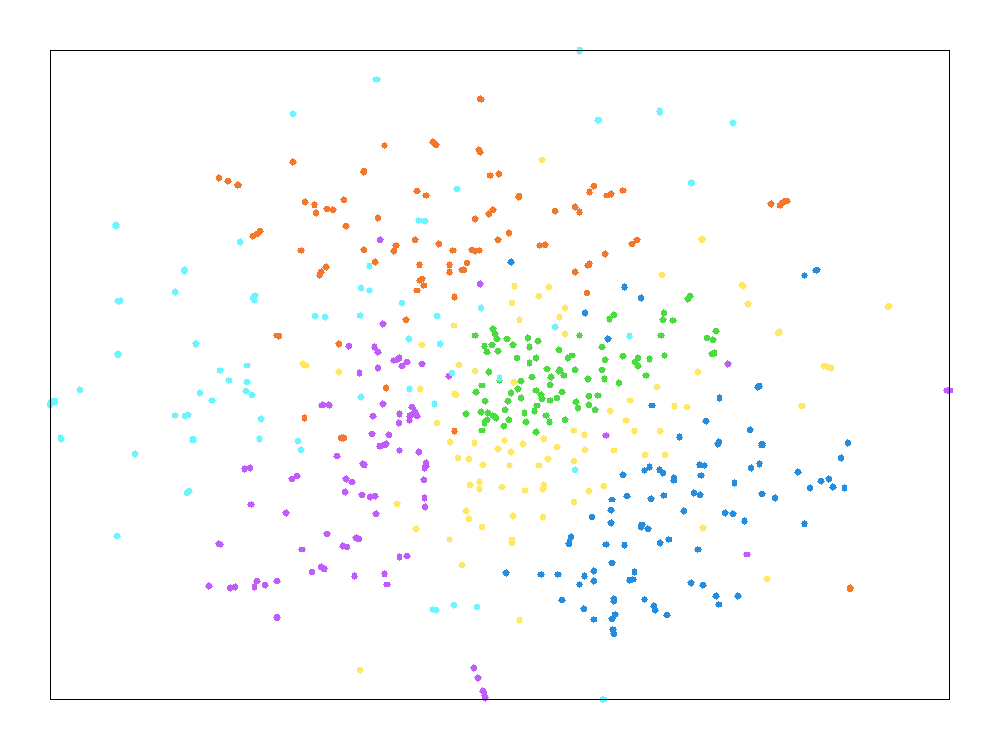

# TSMMIS MATLAB: Self-Supervised Few-Shot Steel Defect Recognition

MATLAB implementation of a TSMMIS-style pipeline for few-shot steel surface defect classification on **NEU-CLS**.

## Highlights

- End-to-end pipeline in `main_TSMMIS.m`
- Uses mostly unlabeled training data + few labeled samples per class
- Evaluates true few-shot settings: **1/2/3/4-shot**
- Saves evaluation and visualization artifacts in `evaluation/results/`

## Dataset

- Dataset path: `data/NEU-CLS`
- Classes: `cra`, `in`, `pa`, `ps`, `rs`, `sc`
- Project dataset used here: **240 images per class** (1,440 total)
- Split in code: **60% train / 40% test** (`config.trainRatio = 0.6`)

### Sample defect images (from this repository)

<table>
  <tr>
    <td align="center"><b>Crazing</b><br></td>
    <td align="center"><b>Inclusion</b><br></td>
    <td align="center"><b>Patches</b><br></td>
  </tr>
  <tr>
    <td align="center"><b>Pitted Surface</b><br></td>
    <td align="center"><b>Rolled-in Scale</b><br></td>
    <td align="center"><b>Scratches</b><br></td>
  </tr>
</table>

## Pipeline (main_TSMMIS.m)

1. Data preparation (`DataLoader`)
2. Encoder initialization (`resnet18` if available, fallback otherwise)
3. Unlabeled feature pretraining and transform learning
4. Few-shot evaluation with repeated randomized episodes
5. Result saving (`evaluation_results.mat`)
6. t-SNE embedding + visualization export

## Experimental Results (from project run)

| Setting | Labels/Class | Mean Accuracy | Std Dev |
|---|---:|---:|---:|
| 1-shot | 1 | 88.13% | 4.68% |
| 2-shot | 2 | 93.11% | 2.64% |
| 3-shot | 3 | 94.86% | 1.85% |
| 4-shot | 4 | 95.75% | 1.51% |

## Result Visualization

**t-SNE of learned test features**

<p align="center">
  
</p>

## Requirements

- MATLAB (R2021b+ recommended)
- Deep Learning Toolbox
- Image Processing Toolbox
- Statistics and Machine Learning Toolbox
- Parallel Computing Toolbox (optional, for broader GPU workflows)

## Run

```matlab
cd D:/MVRP_Project/TSMMIS_MATLAB
main_TSMMIS
```

## Output artifacts

- `models/pretrained_encoder.mat`
- `evaluation/results/evaluation_results.mat`
- `evaluation/results/tsne_embedding.mat`
- `evaluation/results/tsne_visualization.png`

## Project structure

```text
TSMMIS_MATLAB/
├── main_TSMMIS.m
├── data/NEU-CLS/
├── models/
├── training/
├── evaluation/
├── utils/
└── docs/
```

